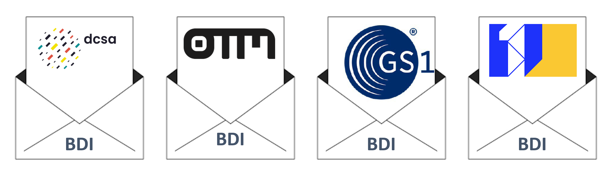

# 🛣️ Logistics Event Ontology

## 1. Introduction&#x20;

There is a growing demand from Beneficial Cargo Owners (BCO) to create more visibility in the supply chain: visibility of the operational planning and execution of all the steps between ordering goods and receiving the consignments in the distribution center or warehouse of the BCO.

Each transport leg in the consignment journey results in one or more events which are to be communicated between parties directly involved in the transport leg. The event communication leads to data exchanges, typically using specific systems, platforms and data formats. The diversity of parties, systems and data formats are a barrier to automated exchanges.&#x20;

In summary, there exists a wide variety of data formats and semantic definitions in supply chains. This leads to the issue depicted in the following figure:&#x20;

***

<figure><figcaption></figcaption></figure>

> _It is unfeasible for BCOs wanting to track & trace their goods to adopt all the data standards in the field. Meanwhile, logistics partners do not wish to switch to different data standards if they already have a standard in use. A  global unification of data standards is not a practical option for the near future._&#x20;

***

The Logistics Event Ontology (LEO) was developed to resolve this issue. LEO functions as an envelope around the existing standards, thereby allowing for domain-specific standards next to a shared format.

<figure><figcaption></figcaption></figure>

### 1.1 Purpose&#x20;

The purpose of this building block is to describe the creation and usage of a light-weight common BDI format, called LEO (Logistics Event Ontology). The purpose of this format is to bridge the existing standards in the realm of logistics data sharing, like [OTM](https://opentripmodel.org/), [FEDeRATED](https://www.federatedplatforms.eu/), [OneRecord](https://onerecord.com/), [DCSA](https://dcsa.org/), [GS1](https://www.gs1.org/), [UN/CEFACT](https://unece.org/trade/uncefact), [EDIFACT ](https://unece.org/trade/uncefact/introducing-unedifact)and many others. It is not the intention to fully map all details of all standards onto a single model. Instead, the LEO-format distils the minimal data needed to follow goods through the supply chain based on the perspective of the BCO.

### 1.2 Functional details

The BDI framework separates the envelope from the payload, thereby separating event data from other operational data. The BDI envelope is a notification of an event with additional data and metadata, combined with a link to the endpoint of the data owner where more (sensitive) data about the event may be requested. The data owner evaluates the request and provides data to the requesting party on a 'need-to-know' basis.

The Logistics Event Ontology (LEO) is derived from existing standards, especially the [GS1 EPCIS ](https://www.gs1.org/standards/epcis)standard. This standard, however, does not allow for the modelling of events in the future. [OpenEPCIS ](https://openepcis.io/)— an open-sourced fully compliant implementation of the EPCIS standard — resolves this issue by allowing for extensions on the existing model. LEO uses this standard and combines it with the modelling of future events.&#x20;


LEO supports the use of standard operational trip data by operators (such as carriers) to generate notifications of events to cargo owners or authorities, leading to efficiency and productivity increases.


## 2. Interactions with other building blocks

### 2.1. Event publish-subscribe service

This building block is closely linked with the [Event Publish-Subscribe Service](logistics-event-ontology-1.md#id-2.1.-event-publish-subscribe-service). The LEO format is mostly geared towards:&#x20;

1. The description of events&#x20;
2. The minimal data needed to communicate between modalities and existing standards.&#x20;

IT defines templates for frequently-used common logistic events and their linkage to domain standards.

## 3. Attached documents





