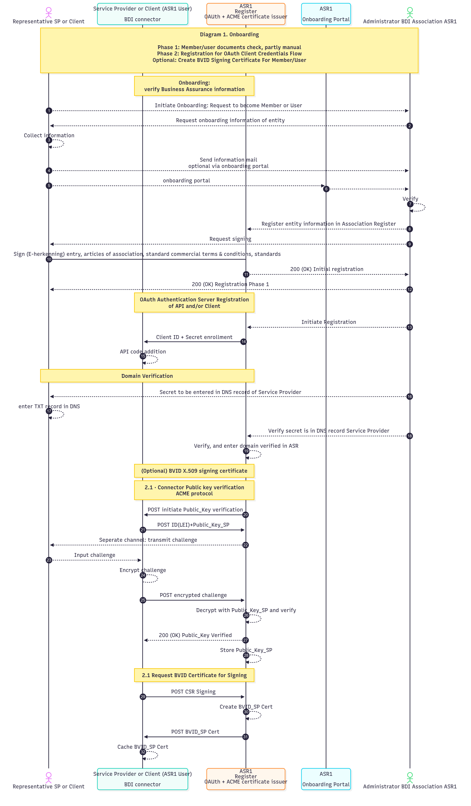

---
cover:
  light: >-
    https://images.unsplash.com/photo-1521791055366-0d553872125f?crop=entropy&cs=srgb&fm=jpg&ixid=M3wxOTcwMjR8MHwxfHNlYXJjaHw2fHxhZ3JlZW1lbnR8ZW58MHx8fHwxNzY0MTQ4MzM2fDA&ixlib=rb-4.1.0&q=85
  dark: >-
    https://images.unsplash.com/photo-1450101499163-c8848c66ca85?crop=entropy&cs=srgb&fm=jpg&ixid=M3wxOTcwMjR8MHwxfHNlYXJjaHwxfHxhZ3JlZW1lbnR8ZW58MHx8fHwxNzY0MTQ4MzM2fDA&ixlib=rb-4.1.0&q=85
coverY: 0
coverHeight: 488
---

# Onboarding Terms and Conditions

## 1. Introduction

The goal of an Association is to enable efficient data sharing between independent companies by
\
providing a neutral member-governed entity that serves as a trust anchor. This trust anchor is based on identity, authorization and compliance. Without the use of Associations, trust is negotiated bilaterally. Associations allow for standardized trust, which reduces costs and risks. This enables faster collaboration, less integration effort, and better compliance.&#x20;

## 2. Concepts

Some relevant concepts for the BDI onboarding are given below.

<strong>Association</strong>

A legal entity created and governed by its members that provides the neutral rules and
\
structures needed to enable trusted data sharing between companies.

<strong>Association Administrator / Authority</strong>

The independent role or organization that runs the daily operations of the Association (such as maintaining registers and supporting onboarding), while remaining accountable to the
\
members who set the rules.

<strong>Association Register</strong>

The official list maintained by the Association that contains all participating members, users,
\
and their declared relationships, so every participant can see who is part of the network and
\
under what conditions.

<strong>Members</strong>

The voting participants who govern the Association. In most cases they will also be the user.&#x20;

<strong>Users</strong>

Organizations that only _use_ the services (consume or provide data), but that do not determine the policies. Users can also be members.&#x20;

### 2.1 BDI Association

A BDI Association is a local entity formed by a group of participants within the framework. The legal structure of an Association can vary, as it could for example be a foundation or cooperative. Irrespective of its legal structure, the Association serves as the operational anchor for both federated trust/authentication and local onboarding within the BDI Framework. Members of a BDI Association can engage in multiple sectors and data exchanges, participating in dynamic virtual networks composed of members from different Associations. These networks operate on zero-trust principles, treating members from other Associations as untrusted by default until trust is established.

#### 2.1.1 Core functions of an association

The core functions of an Association can be summarized by the following:&#x20;

1. Serves as a trust anchor (identity, authorization, compliance)
2. Defines and enforces common rules (onboarding, periodic check/assessments, dispute resolution)
3. Provides neutral member-driven governance
4. Operates an Association register of members, systems, credentials, and
   \
   endpoints
5. Records system-organization relationships
6. Offers onboarding support and operational monitoring of the Association
   \
   components
7. Facilitates dispute handling and arbitration between participants
8. Allows scalable collaboration/interoperability with other Associations
9. Provides optional service integration, helpdesk, back-office services and usage
   \
   accounting and settlement services

### 2.2 Onboarding

It is recommended that an onboarding mechanism is introduced for new members, if the Association desires to raise the standards for its members. New members are admitted by vote of the existing members. Their identity is verified (e.g. via KvK/LEI/EORI) and fraud register and insolvency checks are performed. The new member should accept the terms of usage, periodic revalidation and revocation.&#x20;


Consider the different definitions of "member" and "user" given in [#id-2.-concepts](onboarding-t-and-cs-association-articles-1.md#id-2.-concepts "mention").&#x20;


The following aspects can be taken into consideration:

* vetting the member
* checking roles the member wants to fulfill&#x20;
* verifying credentials and certificates (trust chain)
* verifying that legal contracts are signed by functionaries with a mandate
* verifying the compliance and security of the IT applications they use (conformity tests)

The result of onboarding is an entry in the local Association Register.

#### 2.2.1 Coherent security

The registrations stored in the Association Register need to be secured against tampering. The process outlined in this section reduces the possibility of attack vectors directed to the staff of the Association Administration (social engineering, blackmail etc.), the most common attack vector in these cases.

The following steps apply to new registrations, updates to registrations and depreciation.



**Prepare**

A complete set of attributes is prepared; for updates, this includes all data in the registration (including any attributes that haven't changed).

During preparation attributes can be added, removed and modified freely. Ideally, there is a way to validate the dataset during preparation, but it must be possible to work with intermediate/incomplete data until submitting for verification



**Verify**

Verification is an automated process.

Once submitted for verification the dataset is kept immutable; it must not be possible to change datasets during or after verification. If changes have to be made they will be fully re-submitted and follow the full prepare/verify/commit process.

Once the verification stage is completed, it can be queued for commit.



**Commit & sign**

Once verified, the Association Functionary will also do any non-automated checks, for instance checking the (digital) signature on any signed documents provided.

The Association Functionary cannot change the submission. The only possible actions are "reject" or "commit" or “deprecate” an already committed submission.

It is a requirement that non-repudiation of the action taken by the Association Functionary is supported.

Only a commit will add, update or modify the registration in the Association Register. If changes are not committed, they do not affect the Register.



Shared terms and conditions, data access policies, and data licenses are essential for enhancing interoperability within the BDI Framework.

<table data-view="cards"><thead><tr><th></th><th></th><th data-hidden data-card-cover data-type="image">Cover image</th></tr></thead><tbody><tr><td><strong>Terms and Conditions</strong></td><td>These define standardized contractual clauses, such as Edge Agreements, which are localized terms that improve operational efficiency.</td><td><a href="https://images.unsplash.com/photo-1562654501-a0ccc0fc3fb1?crop=entropy&#x26;cs=srgb&#x26;fm=jpg&#x26;ixid=M3wxOTcwMjR8MHwxfHNlYXJjaHwyfHxydWxlc3xlbnwwfHx8fDE3NjQxMjUyMjV8MA&#x26;ixlib=rb-4.1.0&#x26;q=85">https://images.unsplash.com/photo-1562654501-a0ccc0fc3fb1?crop=entropy&#x26;cs=srgb&#x26;fm=jpg&#x26;ixid=M3wxOTcwMjR8MHwxfHNlYXJjaHwyfHxydWxlc3xlbnwwfHx8fDE3NjQxMjUyMjV8MA&#x26;ixlib=rb-4.1.0&#x26;q=85</a></td></tr><tr><td><strong>Policies</strong></td><td>Data access is authorized by the Data Owner based on the role of the requesting party. Standardizing these policies within a sector can reduce the management burden.</td><td><a href="https://images.unsplash.com/photo-1564189218077-da13d6c81f25?crop=entropy&#x26;cs=srgb&#x26;fm=jpg&#x26;ixid=M3wxOTcwMjR8MHwxfHNlYXJjaHwzfHxwb2xpY2llc3xlbnwwfHx8fDE3NjQxNTkwMjZ8MA&#x26;ixlib=rb-4.1.0&#x26;q=85">https://images.unsplash.com/photo-1564189218077-da13d6c81f25?crop=entropy&#x26;cs=srgb&#x26;fm=jpg&#x26;ixid=M3wxOTcwMjR8MHwxfHNlYXJjaHwzfHxwb2xpY2llc3xlbnwwfHx8fDE3NjQxNTkwMjZ8MA&#x26;ixlib=rb-4.1.0&#x26;q=85</a></td></tr><tr><td><strong>Data licenses</strong></td><td>These define the rights and responsibilities of parties accessing data. For example, an e-commerce transporter may be prohibited from retaining or reusing receiver data. Data licenses can be legally enforceable if included in the onboarding process.</td><td><a href="https://images.unsplash.com/photo-1593871097805-09627f52f4bb?crop=entropy&#x26;cs=srgb&#x26;fm=jpg&#x26;ixid=M3wxOTcwMjR8MHwxfHNlYXJjaHw4fHxsaWNlbnNlfGVufDB8fHx8MTc2NDE1OTA1Mnww&#x26;ixlib=rb-4.1.0&#x26;q=85">https://images.unsplash.com/photo-1593871097805-09627f52f4bb?crop=entropy&#x26;cs=srgb&#x26;fm=jpg&#x26;ixid=M3wxOTcwMjR8MHwxfHNlYXJjaHw4fHxsaWNlbnNlfGVufDB8fHx8MTc2NDE1OTA1Mnww&#x26;ixlib=rb-4.1.0&#x26;q=85</a></td></tr></tbody></table>

### 2.3 Governance principles and legal

An Association is a legal entity, which can for example be a foundation, an association or a cooperative. Its members, as voting members, define the onboarding rules, assurance levels (agreed levels of trust), dispute handling, funding model and sanctions.&#x20;

An important concept within an association is the concept of **neutrality**: no single party within the association dominates.&#x20;

### 2.4 Onboarding Process

The diagram below describes the preferred onboarding process through which an organization becomes a participant in a BDI association and connects technically to the federation via a BDI connector. The sequence combines organizational admission with the technical registration steps required to establish trust and enable secure machine-to-machine interaction.

The model assumes a federated architecture in which independent organizations join an association that maintains shared governance rules and a central Association Service Registry (ASR). This registry acts as the authoritative source for participant identities, endpoints, and cryptographic keys.

Onboarding therefore, occurs in two stages. First, the organization is admitted as a member through verification of business assurance information and acceptance of the association’s legal and governance terms. Second, the participant is technically registered by configuring OAuth client credentials, verifying domain ownership via DNS, and optionally automating the validation of the connector’s public key using the ACME protocol. Alternatively, a BVID signing certificate can be issued.

The process assumes that each participant operates a BDI connector that implements the required protocols and manages authentication, token exchange, and cryptographic key usage. Together, these steps establish the organizational and cryptographic trust necessary for secure participation in the BDI ecosystem.

<figure><figcaption></figcaption></figure>

## 3. Core design decisions

The implementation of the BDI Framework should consider existing sector-specific terms, conditions, and practices. Many trade and standardization organizations are transitioning from paper-based practices to digital ones. It is recommended to build upon the existing body of knowledge and trade practices, per sector.

## 4. Interactions with other building blocks

<a href="../../reference-architecture/trust-kit/policy-agreements.md" class="button secondary">Policy Agreements</a> <a href="../../reference-architecture/trust-kit/edge-agreements.md" class="button secondary">Edge Agreements</a> <a href="../../reference-architecture/data-set-kit/data-licenses.md" class="button secondary">Data Licenses</a>

## 5. Future readings

\[To be added:&#x20;

* Documenten voor onboarding
* Documenten voor opzetten legal entity]

