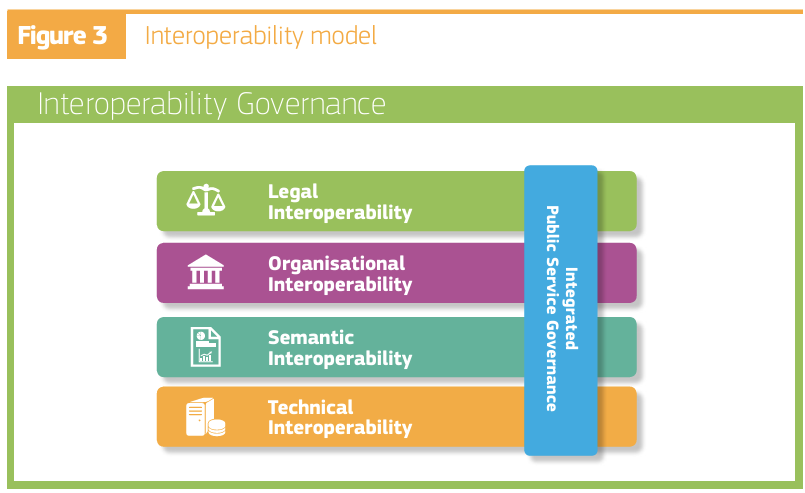

# Interoperability

## 1. Introduction

The European Interoperability Framework: [https://ec.europa.eu/isa2/sites/default/files/eif\_brochure\_final.pdf](https://ec.europa.eu/isa2/sites/default/files/eif_brochure_final.pdf)

describes an interoperability model that is geared toward the public sector. Its describes a "stack" of interoperability subjects.

As a general model it is useful to describe issues and solutions.

<figure><figcaption></figcaption></figure>

The BDI has a focus on a wide generic technical interoperability between entities, supporting **specialized/differentiated**:

* semantic interoperability
* organizational interoperability
* legal interoperability

The world model is that market forces, geo politics, regulation, culture and innovation will create a dynamic universe of sectors/groups that have an interest in driving specialized/differentiated interoperability **within** their group, at the expense of interoperability with other sectors.

## 2. Technical Interoperability

The design philosophy to enhance generic technical interoperability is based upon:

* No proprietary development of protocols
  * Reuse known, proven or emerging open standards in a specific configuration
* Rely on already supported digital identities and other digital proofs of claims
