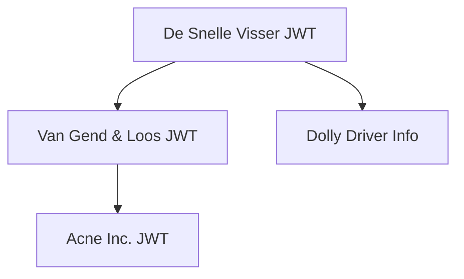

# Representation Chain

#### Summary

The **Representation Chain** is a core architectural building block in the BDI framework. It allows third parties to **verify mandates** — in other words, to confirm that a person, legal entity, or automated process is truly acting on behalf of another.

A **mandate** is a record of representation issued by a **mandator** (the entity assigning authority) to a **mandatee** (the entity receiving that authority). This record transfers **accountability and liability** for any actions taken under that authority from the mandatee back to the mandator.

The Representation Chain enables the secure, verifiable transfer of such mandates using **Representation Evidence** — often implemented via **nested or embedded JWTs**. These can be validated both **online** (e.g. via issuer APIs) and **offline** (e.g. from a QR code or token).

#### Purpose

The Representation Chain supports use cases across:

* Human-to-Machine (H2M)
* Machine-to-Machine (M2M)
* Human-to-Human (H2H) representation scenarios

It is particularly critical for managing **boundaries** in both:

* [Physical Asset Boundaries](https://app.gitbook.com/o/6jFQJqnMRyd4T2pZ1IBi/s/EsnYrgeqsPPZtbALTQAj/~/changes/224/reference-architecture/boundary-management/physical-asset-boundaries)
* [Legal Asset Boundaries](https://app.gitbook.com/o/6jFQJqnMRyd4T2pZ1IBi/s/EsnYrgeqsPPZtbALTQAj/~/changes/224/reference-architecture/boundary-management/legal-asset-boundaries)

The Representation Chain is a **method**, not a central registry. It functions through verifiable tokens (e.g., JWTs) exchanged directly between actors.

#### Relationship to Other Building Blocks

The Representation Chain directly or indirectly connects to:

* **Authentication**
* **Authorisation**
* **Digital Identity**
* **Common Roles**
* **Professional Qualification Chain** – a parallel method to prove qualifications of mandatees
* **Verifiable Credentials** – a future integration for structured credentials

#### Elements & Core Functions

A Representation Chain maintains:

* The **digital identity of the mandator**
* The **digital identity of the mandatee(s)**
* The **scope** of the mandate:
  * Role-based
  * Optionally order- or task-specific (transient)
* Additional contextual data as needed

The **Representation Evidence** itself typically takes the form of a **nested JWT** that:

* Is transferred to the mandatee (e.g., a worker or system)
* Can be shown to or validated by third parties
* Can be verified offline (signature checks, timestamps)
* May optionally link back to the issuer for online validation

Importantly, **verifiers do not need to be BDI Association members**, greatly lowering the barrier to implementation.

***

### Executive Summary for Business Decision-Makers

In day-to-day logistics, inspection, and maintenance operations, a common challenge is verifying whether a person or system is **truly authorized** to act on behalf of a client. This includes subcontractors, drivers, service engineers, and IT systems.

The **Representation Chain** enables verifiable, traceable delegation. One practical implementation of this method is using **JSON Web Tokens (JWTs)** as digital proof. JWTs make it possible to:

* Digitally verify delegation chains
* Confirm identity and qualifications
* Reduce liability and operational risk
* Operate offline or online

Instead of relying on printed documents, emails, or phone calls, this approach provides secure, signed digital tokens that travel with the mandatee.

***

### Why Use JWTs?

JWTs are a global standard for compact, URL-safe, signed tokens. Their adoption across identity, access, and security domains makes them a strong fit for implementing Representation Chains.

**Key benefits:**

* Support for **embedded (nested) tokens**, representing delegation chains
* Compatibility with **Verifiable Credentials and Presentations**
* Easy to process using existing libraries (Python, Java, etc.)
* Support for **offline validation**
* Fully traceable and auditable using cryptographic signatures

***

### Example: Transporting Hazardous Materials Using JWT Representation Evidence

This example illustrates how a chain of representation is securely and digitally established using embedded JWTs in a real-world logistics setting.

#### Scenario: Chemical Pickup by a Subcontracted Driver

1. **Acne Inc.**, a chemical supplier, sells hydrofluoric acid to a customer.
2. Acne agrees to send a truck to **Lets-B-Chemical** for pickup, but lacks transport capacity.
3. **Van Gend & Loos** is contracted to handle the pickup.
4. Van Gend delegates the task to **De Snelle Visser**, who already has a truck en route.
5. **Dolly Driver**, employed by De Snelle Visser, is assigned to perform the pickup.

Dolly must prove at the pickup location that:

* She is authorized to act on behalf of De Snelle Visser
* De Snelle Visser is acting on behalf of Van Gend & Loos
* Van Gend & Loos is acting on behalf of Acne Inc.
* She is qualified to handle dangerous goods

#### JWT Construction Across the Chain

Each party creates a JWT embedding the one they received:

* **Acne Inc.** issues a JWT authorizing Van Gend & Loos
* **Van Gend & Loos** issues a JWT embedding the Acne JWT
* **De Snelle Visser** embeds both and adds Dolly’s identity and qualifications

Dolly presents this multi-layered JWT and her ID. The security officer validates it by checking each signature and claim.

#### Visualization

### Core Requirements for Representation Evidence

A JWT-based Representation Evidence must:

* Confirm identity of the mandatee
* Show delegation chain
* Include start and end times (`nbf`, `exp`)
* Include professional qualifications (e.g., certifications)
* Provide traceability (`jti`) and revocation checks
* Optionally include real-time validation endpoints

***

### Common Claims Used in BDI JWTs

#### Standard (Registered) Claims

| Claim         | Description                           |
| ------------- | ------------------------------------- |
| `iss`         | Issuer (e.g., `_bdi.acme.com`)        |
| `sub`         | Subject of the JWT                    |
| `aud`         | Intended audience                     |
| `nbf` / `exp` | Validity timeframe                    |
| `iat`         | Issued-at timestamp                   |
| `jti`         | Unique identifier for revocation      |
| `vc` / `vp`   | Verifiable Credential or Presentation |

#### BDI Custom Claims

| Claim  | Purpose                |
| ------ | ---------------------- |
| `fl`   | Freightbill reference  |
| `efti` | eFTI link              |
| `ipa`  | Originating IP address |

***

### Business Benefits

**Operational efficiency**

* No calls or printed permission slips
* Easily implemented using QR codes

**Security and compliance**

* Tamper-proof and auditable
* Supports privacy (selective disclosure)

**Legal assurance**

* Cryptographic signatures tie each action to its issuer
* Chain of trust is traceable

**Scalability**

* Supports both humans and systems (M2M)
* Decentralized, no single point of failure

***

### Implementation Guidance

* Use `https://_bdi.company.com` for `iss` and `sub` claims
* Expose `/repr` endpoints for revocation checks
* Include professional role or qualification data in JWT
* Design for offline use; online validation should be optional

***

### Learn More

* [RFC 7519 – JSON Web Token (JWT)](https://datatracker.ietf.org/doc/html/rfc7519)
* [BDI Representation Register](https://bdinetwork.org/framework/representation/)
* [VC Data Model 2.0](https://www.w3.org/TR/vc-data-model-2.0/)
* BDI Edge Agreements
* [IANA JWT Claim Registry](https://www.iana.org/assignments/jwt/jwt.xhtml)

**Documents**





