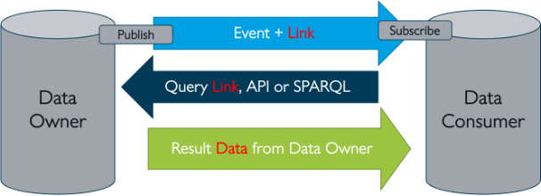

# Notification pub/sub service

### Summary

Notifications of events are the digital representation of the result of events in the physical world: for example, ‘expected arrival time issued’, ‘container has been unloaded’. So, a notification of an event is the result of an event, not the event itself, events occur in the physical world, notifications of events occur in the digital world.

Notifications are published on channels (a.k.a. topics), to which all involved parties can subscribe. Following a publication of a notification, all subscribers will receive it.

Take the event that a full container has been loaded onto a container ship in China. All parties involved in the Netherlands, from the port authority, the container terminal, forwarders/processors, Customs, hinterland transporters to the shipper that ordered the goods, want to track the status of the ship and this container from that moment onward. And they create events because of this knowledge: a declaration, reservation of capacity, etc.

An important concept of the BDI is that involved parties can subscribe to channels and their ‘daughters’: they receive all notifications of events that are published to that channel. If required (and permitted) a party can request more data from the source. The concept of notifications of events and subscribing to them is broadly applicable: take the schedule for a building site for example. It is highly effective for all the suppliers and subcontractors if new things or changes to the schedule are automatically identified.

### Purpose of the building block

‘Event-driven’ communication is a way of restructuring the logistics of the information exchange between the IT systems of companies. Instead of a data owner sending messages when something of importance needs to be communicated (‘fire and forget’, ‘messaging’), all parties involved receive a signal (‘notification’) from the data owner that something relevant has happened (‘publish event to subscribers’).

That event contains metadata and a link to the source of the data. The receiving party evaluates the metadata and decides whether to follow the link to the source and access the data.

<figure><figcaption></figcaption></figure>

The Event Pub-Sub Service handles the centralized parts of this event-based communication. The actual data exchange happens directly between the parties in a federated manner.

### Concepts

_Notifications_ trigger communication between decoupled services and are common in modern applications built with microservices. In the BDI, a notification corresponds to an event in the physical world.

_Events_ occur in the physical world and are changes of state like a container being unloaded from a ship or a parcel delivered to its destination. Events can also be of a more administrative nature, such as the signing of a contract or the publication of a new expected arrival time.

Notifications may or may not carry data about the event (the item purchased, its price, or a delivery address).

Notifications are published to _channels_ of the pub/sub service and are delivered to all subscribers on the channel.

A party that publishes a notification is called the _producer_, parties that receive the notification are called _consumers_.

The part of the infrastructure that is responsible for managing channels and notifications is called the _router_.

A producer publishes an event to the router, which filters and pushes the events to consumers. Producer services and consumer services are decoupled, which allows them to be scaled, updated, and deployed independently.

This approach has many advantages:

* Efficiency:
  * No polling needed.
  * &#x20;Low load on resources.
* Effectiveness:
  * Easy to distribute notifications to many involved parties.
  * ‘Single truth’ data at the source.
  * Synchronization of activities.
* Control:
  * Distributing notifications with metadata only reveals relatively little information that can be abused.
  * Data access requires authentication. This increases the control over valuable data.
  * Authorization rules define what data can be accessed by what role/party.
  * All access to the data can be logged.

### Choreography

In supply chains the chain of business activities starts when a Seller and Buyer agree upon the transaction. This agreement typically includes terms related to transport, insurance, customs, the handover of responsibilities, and payments. The successful execution of this agreement often requires coordination among a large set of actors, including authorities and their subcontractors. This coordination is managed through a "choreography" of actions, where each action is triggered by planned or executed events.

The choreography describes which channels there are and which parties can subscribe to them. As the design of an appropriate choreography can be challenging and has major impact on the efficiency of the pub/sub service, this subject is discussed in detail in a separate [page](event-choreography.md).

### Implementation Considerations

According to EPCIS (ISO/IEC 19987), a notification contains at least the following four aspects: what, where, when, and why and an optionally fifth: how.

* What – to which object or entity does this event primarily relate (e.g. pallet, order, truck, wagon, etc.)?
* Where – at which location did the event take place (warehouse receipt door, terminal access)?
* When – on what date and time did the event take place?
* Why – the reason (and in which business activity exactly) that the event took place (goods receipt, freight collection, transport document definitively agreed, etc.).
* How – in what state (how) is or was the cargo being transported at the time of the event?

However, in line with BDI federation rules, data on these aspects is not always added directly to the notification. In instead, only a link to the source may be included, and interested parties can get the necessary data at the source.

### Interlinkages with other building blocks

There are links with the following building blocks:

* Semantics
* Data model
* Data format
* Data protocol
* Zero Trust Check

### Elements and their key functions

The following pattern describes the typical interaction with the Pub-Sub service. First, we enter a configuration phase:

* The data owner creates a new notification channel at the service. The channel name is the EventType, in this example, of the data the owner wants to share.
* A data consumer asks permission to subscribe to the channel “EventType from Data Owner” using the service. The data consumer will then be notified if the data owner triggers a signal on the event channel he is interested in.
* The request for subscription is communicated back to the data owner. The data owner decides if the request should be granted. Fi. based on several queries to the different registers part of the BDI like the Reputation and Qualification registers. Data and trust sovereignty means, in this case, that the owner always has control over who has access to his data.

In this case the data owner grants permission to the data consumer to subscribe to his EventType channel.

<figure><figcaption></figcaption></figure>

All is now setup for the actual event-based communication:

* An event occurs at the data owner, and he sends a trigger through the channel “EventType from Data Owner” to all his subscribers.
* The trigger is also sent to the data consumer who can use the embedded meta-data in the event trigger to decide if he wants to request the associated data of the event at the data owner.
* The data consumer decides to request the data at the owner’s location using the link sent along as part of the trigger.
* The owner can now do several checks to see if the data consumer is (still) allowed to access his data. In this case the owner agrees, and the data is sent as response to the query from the consumer.

### Core design decisions

_Granularity of event channels_

* The granularity of the event channel is an important issue. Depending on the chosen strategy one would either create the need for extra filtering logic at the consumer or at the owner. The specific use case should be leading on how fine-grained the channels should be setup.

_Multiple event brokers in a network_

* It is yet unclear how multiple event brokers, from different suppliers, would work together in a decentralized network. Most available open and commercial solutions do support multiple brokers but typically only the ones from the same supplier.

### Further reading

* Demonstration of a working Event Pub-Sub setup: [https://bdinetwork.org/wp-content/uploads/2024/01/2023-BDI-Event-Distributie-PoC-NL.pdf](https://bdinetwork.org/wp-content/uploads/2024/01/2023-BDI-Event-Distributie-PoC-NL.pdf)
* EPCIS (ISO/IEC 19987:2024) [https://www.iso.org/standard/85557.html](https://www.iso.org/standard/85557.html)
* DCSA: [https://www.dcsa.org/standards/track-and-trace](https://www.dcsa.org/standards/track-and-trace)
