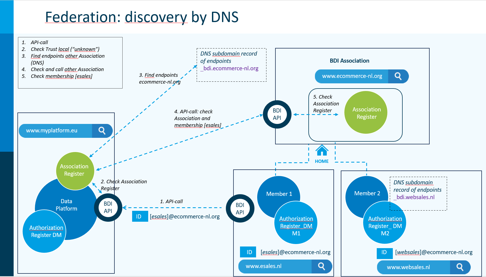

# Association Register

### Summary

The building block Association Register has the basic function of registering:

* identities of recognized legal entities
* digital proof of the identity (credentials, for example certificates)
* the roles these entities can have
* the trust level of each entity

The Association Register is an operational building block that is called during the zero-trust authentication and authorization process.

The richness of the building block is governed by the subsidiarity principle: in its most simple and limited form an Association Register is maintained by and for a Data Service Provider, in its most rich form it is maintained by a BDI Association that federates with other BDI Associations.

Optional functions that are expected when a BDI Association administers their own Association Register are:

* keeping a reputation score per entity
* registering onboarding agreements
* perform federated verification checks of unknown legal identities that are Member of another BDI Association
* registering preferred business partners in a federated environment

### Purpose of the building block

The purpose of the Association Register is to automate and facilitate trust assessments of entities in the sequence of Authentication – Trust Assessment – Authorization as performed by a Zero Trust endpoint.

A shared Association Register reduces costs and combines experiences in shared dynamic reputation scores.

A shared Association Register in a legal entity (BDI Association) can be augmented by onboarding procedures, including the signing of legal documents, including terms and conditions.

A federated Association Register automates the basic trust checks of entities that claim to be a Member of another BDI Association, by verifying the other BDI Association and verifying the membership.

A federated Association Register automates the registering of preferred Business Partners: members of other BDI Associations that have a special status.

An Association Register is considered a technological solution to facilitate the role of the Association Administrator.

### Concepts

The following concepts (from the BDI Glossary) are particularly relevant in this building block:

_Association -_ Legal entity that serves as trust anchor for both federated trust/authentication and local onboarding. A BDI Association is the “root Association” for its Members.

_Association Administrator -_ Functionary responsible for operating the services of a BDI Association.

_Association Register -_ Technological solution for the register of recognized legal entities, real time accessible by associated data provider(s) (Members)

_Member -_ Legal entity as member of the BDI Association of its choice

_Federation of Associations -_ A series of collaborating BDI associations

_Outsider -_ Member of a different BDI Association than the root (root as in "home" of the member) .  Note: this a relative perspective, from the position of a Member of a given instance (BDI Association). Members of the same instance are “insiders”, anybody else is an Outsider and vice versa.

_Preferred Business Partners -_ Outsiders who have agreed to specific terms and conditions of a local BDI Association that maintains its own Business Partner Reputation Model

_Root Association -_ The association a member is part of, also known as "Home Association".

_Visitor -_ Outsider with a better reputation score than a defined minimum.

### Risks

An Association Register is a core part of automated trust assessment. This requires both:

* Rigorous design and testing for IT-security weaknesses (cryptographic libraries, protocols, pentesting, supply chain attacks etc.)
* An operational security process that minimizes the risk of humans as attack vector (social engineering, pressure) to compromise the integrity of the register

The human attack vector is considered to be the most risky: onboarding should therefore be a one-way automated process in three separate steps (see also onboarding T\&Cs Association articles):

* Collecting information (automated and/or manual)
* Verifying information and test trust chain (automated)
* Committing to the register (manual action by functionary)

Modification of information should only be possible by deleting or deprecating information, followed by a new onboarding process.

### Interlinkages with other building blocks

This building block provides the technical implementation supporting the building block “Onboarding Terms and Conditions”, in which the operational processes and requirements regarding the onboarding of a BDI Association are described.

Furthermore, it particularly supports the building blocks “Authentication” and “Certified roles” (but not limited to) by providing trust about Members and their roles.

In fact most building blocks will have some form of link with this building block, since the Association Register is a core topic of the BDI.

#### Stages of implementation

In its most simple form a data service provider has its own private Association Register to recognize data consumers. The limitations of such an implementation are obvious, yet it may be a stage to reach the next level.

<figure><figcaption>
Association Register Private, or common to Association
</figcaption></figure>

A shared Association Register adds the benefit of cost reduction, and trust/reputation sharing.

An Autorization Register may be shared as well.

<figure><figcaption></figcaption></figure>

A federated Association Register allows in principle an unlimited universe of parties that can check each other credentials as Member of their particular BDI Association, vice versa.

The principles of by discovery through a standard \_bdi subdomain to facilitate federation are depicted below.&#x20;

<figure><figcaption></figcaption></figure>

**Extra function in existing trade body (Governance)**

The benefits of shared services, shared standards, shared Terms and Conditions and increasing the negotiation power by coordinating as a group are known in the "analog" world. A large number of trade associations already exist, specific to a sector/region. These trade associations are natural hosts for Association Register functions. The assumption is that in most cases existing trade associations will upgrade their service offerings to include support for the BDI, instead of creating a new legal entity specifically for support of the BDI.

### Elements and their key functions

An Association Register can have the following functions

* An Association Administrator can register Members after executing the onboarding process as defined by the particular Association
* An Association Administrator can deregister a Member, for instance when the Member requires it to do so, when a membership expires, or when a Member is to be excluded from membership due to a breach of terms and conditions.
* An Association Administrator can delete or deprecate the registration of a Member, to be superseded by an improved registration.  Deprecation is preferred as the historical information may be useful in autopsies of security incidents.
* Members can use the Association Register to assess the trust level of another Member and to retrieve information about Members (in for instance what roles they fulfill).
* Members can use the Association Register to asses the trust level and reputation of Visitors and Preferred Business Partners
* Members can add to the Reputation score of registered entities.
* Members can use the Association Register to asses the reputation of a previously unknown Outsider: the Association Register queries the Association Register of the Outsider.

### Core design decisions

The following design decisions form the basis for this building block:

* An Association Register can operate standalone, without federation.
* An Association Register can be shared between parties in a BDI Association, or shared by multiple BDI Associations (database or shared ledger).
* An Association Register can be federated with other Association Registers, without being connected or known beforehand: there is no global register of Association Registers. The discovery mechanism is DNS based.
  * This requires that an Outsider, Visitor or Partner identifies the URL of its root Association.
* An entity can choose to be Member of multiple Associations.
  * An example is an e-commerce retailer: one side of the company is dealing with shipping purchased goods by maritime transport (containers) to its local warehouses, the other side of the company is deeply involved in e-commerce retail and distribution. The large difference in semantics, terms and conditions, roles, and parties (including authorities) involved is visible in the different trade organizations (maritime container transport versus e-commerce retail). The difference may lead to the choice to be Member of two different Associations.

### Future topics

To be discovered is how the Association Register can technically support the building block “Business Partner Reputation model”.

The federation of Association Registers might also be based on the proposals of Open-ID on federation.

The identification of Outsiders and its Root Association needs to be detailed.

### Further reading

This building block has been derived but modified from the following sources, that provide opportunity for further reading:

* ​[DSSC Blueprint building block “Participation Management”](https://dssc.eu/space/BVE/357074624/Participation+Management)​
* ​[iSHARE Framework documentation](https://framework.ishare.eu/)​
* ​[iSHARE Developer Portal documentation](https://dev.ishare.eu/)

