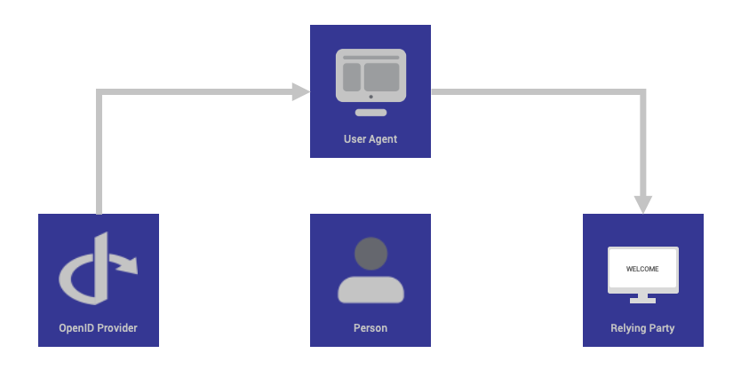

# Digital Identity M2M

**Summary**

This building block supports trust among participants by defining how digital identities play a role in BDI in machine-to-machine (M2M) interactions.

Digital identifiers for natural persons are described in Digital Identity (H2M).

In it's implementation, BDI aligns with iSHARE's implementation of digital identities, preferring PKI certificates issued by a reputable identity provider as digital identity of parties like Service Providers. In Europe the eIDAS regulation is a solid foundation for the identity ecosystem.

**Purpose of the building block**

The purpose of this building block is to support the framework for trust among parties, by ensuring that parties can provide and receive a verified digital identity.  An authenticated digital identity is the prerequisite for determining trust and subsequent authorization.

The building block ensures that interactions within BDI (onboarding, offboarding, data exchange, service consumption, etc.) will take place between identified and authenticated  parties.

**Concepts**

The following concepts (from the BDI Glossary), all regarding legal entities, are particularly relevant in this building block:

| Member                      | Legal entity as member of its “home”  BDI Association                                                                                                   |
| --------------------------- | ------------------------------------------------------------------------------------------------------------------------------------------------------- |
| Business Partners           | Members of other BDI Associations than the “home” BDI Association                                                                                       |
| Preferred Business Partners | Outsiders  who have agreed to the specific terms and conditions of the local BDI Association, which maintains its own Business Partner Reputation Model |
| Outsider                    | Anyone who is not a member of a BDI Association                                                                                                         |
| Visitor                     | Outsider with a better reputation score than a set minimum                                                                                              |

&#x20;

<figure><figcaption></figcaption></figure>

_How a Business Partner from another BDI Association can become a preferred Business part of a BDI Association._

**Risks**

An insufficient framework for digital identity, might lead to a lower level of trust among parties and will harm the overall trust in BDI.

**Interlinkages with other building blocks**

This building block describes the BDI principles for digital identity for M2M interactions.

The related building blocks are:

\-          Digital Identity H2M

\-          Authentication M2M

\-          Authentication H2M

\-          Authorization

\-          Association register

\-          Zero Trust Check

The most important related Kits are

\-          Trust Kit

\-          Federation Kit

\-          Boundary Management Kit

&#x20;**Core design decisions**

A digital identity has to be linked with the legal identifier of the legal entity that :

\-          controls

\-          takes responsibility and accountability for

the IT-process that uses the digital identity in interactions with other IT processes.

The EORI-identifier is the standard defined by the EC Customs for European entities. EORI stands for “Economic Operators Registration and Identification”. Not all European entities are required to register an EORI. Therefore, only a subset have registered an EORI. See [https://taxation-customs.ec.europa.eu/customs-4/customs-procedures-import-and-export-0/customs-procedures/economic-operators-registration-and-identification-number-eori\_en](https://taxation-customs.ec.europa.eu/customs-4/customs-procedures-import-and-export-0/customs-procedures/economic-operators-registration-and-identification-number-eori\_en)

Europe also introduced an EUID which is based on the local European Business Registries. This EUID will be used for the eIDAS 2 European Wallet. [https://e-justice.europa.eu/489/EN/business\_registers\_\_search\_for\_a\_company\_in\_the\_eu](https://e-justice.europa.eu/489/EN/business\_registers\_\_search\_for\_a\_company\_in\_the\_eu)

VAT-numbers can also be used to identify organizations. European VAT-numbers can validated on a central site. [https://ec.europa.eu/taxation\_customs/vies/#/vat-validation-result](https://ec.europa.eu/taxation\_customs/vies/#/vat-validation-result)

Other identifier standards that are in use worldwide are:

\-          LEI ( [https://www.gleif.org/en/about-lei/introducing-the-legal-entity-identifier-lei](https://www.gleif.org/en/about-lei/introducing-the-legal-entity-identifier-lei))

\-          DUNS (Dunn and Bradstreet Unique Number System [D-U-N-S Number Navigation Home – Dun & Bradstreet (dnb.com)](https://www.dnb.com/duns.html)

In practice it may be necessary for a party or an association to create a cross-reference register that relates an internal (unique) identifier with multiple external identifiers of a legal entity. One legal entity may have an EORI, LEI and DUNS identifier, or more.

The BDI prefers PKI certificates issued by a reputable identity provider as digital identity of parties like Service Providers.

In Europe the eIDAS regulation is a solid foundation for the identity ecosystem.

Selfsigned certificates for digital identities are a low-barrier entry level solution, with serious limitations on trust, federation and scaling.

* ​F**uture topics**

**Further reading**

&#x20;

* ​[DSSC Blueprint building block “Identity and Attestation Management](https://dssc.eu/space/BVE/357075352/Identity+and+Attestation+Management)​
* ​[https://www.w3.org/TR/vc-data-model-2.0/](https://www.w3.org/TR/vc-data-model-2.0/)​
* ​[iSHARE Framework documentation](https://framework.ishare.eu/), specifically on the topic of identities
*
  * [Identification by EORI](https://framework.ishare.eu/is/identification-by-eori)​
  * ​[The role of Identity Provider](https://framework.ishare.eu/is/functional-requirements-per-role#Functionalrequirementsperrole-IdentityProvider)​
  * ​[The acknowledgment of eIDAS](https://framework.ishare.eu/is/regulation-on-electronic-identification-and-trust-)​

·         ​​[The specifications for the Identity Provider role](https://dev.ishare.eu/identity-provider/authorize.html)​

* ​[iSHARE Developer Portal documentation](https://dev.ishare.eu/)​
